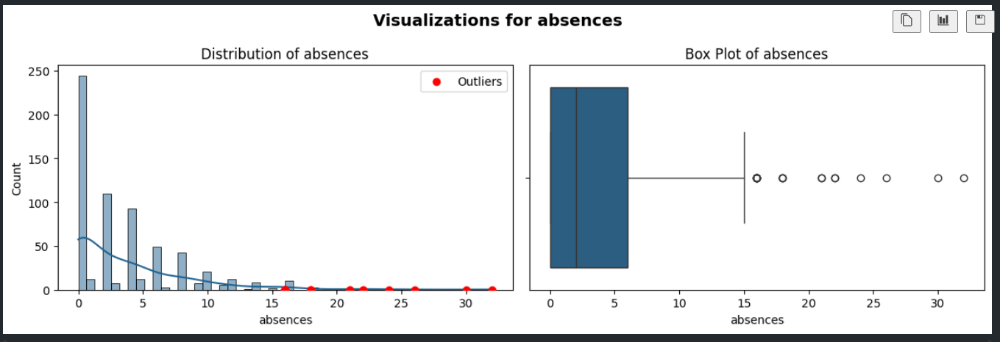
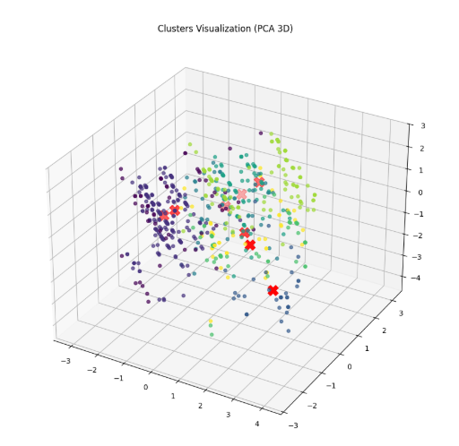
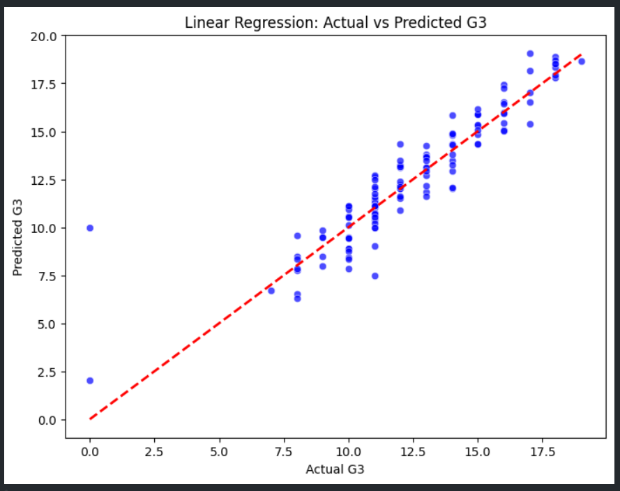

# student-performance-analysis-prediction

## 📖 Project Description

This project focuses on **analyzing student performance and predicting final grades** using machine learning techniques.
The goal is to understand factors affecting student performance—personal, environmental, and educational—and to predict whether a student will achieve a high or low final grade (`G3`) based on their data.

---

## 🗂 Dataset

The project uses the **Student Performance Dataset** with two files:

* `student-mat.csv` (Math course)
* `student-por.csv` (Portuguese course)

**Dataset features (32 columns)** include personal information, family background, behaviors, extracurricular activities, and student grades:

* Personal features: `age`, `sex`, `address`, `famsize`, `Pstatus`, `guardian`, ...
* Educational features: `studytime`, `failures`, `schoolsup`, `famsup`, `paid`, `activities`, ...
* Grades: `G1`, `G2`, `G3` (final grade is the target)

> Note: 382 students appear in both datasets and can be identified using unique attributes.

---

## 🧹 Data Preparation & Feature Engineering

* Missing values handled; most features are imbalanced.
* Outliers were retained as they reflect real-world conditions.

* **Scaling:** Standardization was applied to numeric features since it is **less sensitive to outliers**.
* **Engineered features**:

  * `parent_edu = Medu + Fedu`
  * `study_efficiency = studytime / (absences + 1)`
  * `alcohol_ratio = Dalc / (Walc + 1)`
  * `is_struggling = (failures > 0)`
  * `G1G2_avg = (G1 + G2)/2`
  * `target = 1 if G3 >= 10 else 0`
  * Optional interactions: `studytime_failures`, `goout_freetime`
* `G1` and `G2` were dropped after computing `G1G2_avg`.

---

## 🛠 Modeling

### 1️⃣ Unsupervised Learning: K-Means

* Goal: Group students based on **personal and family-related factors**.
* Results:

  * Students were divided into **8 clusters** based on home influence.
  * Impact on final grades was weak, but strong on other features.

* Visualization: 

### 2️⃣ Supervised Learning: Classification

* Goal: Classify students into **pass/fail** categories.
* Models used: Decision Tree, Random Forest, CatBoost.
* Evaluation metrics: accuracy, F1-score, ROC-AUC.

### 3️⃣ Supervised Learning: Regression

* Goal: Predict students' final grade (`G3`).
* Model used: Linear Regression with main features: `G1G2_avg`, `study_efficiency`, `is_struggling`.
* Performance:

  * **R² = 0.822**
  * **RMSE = 1.736**
* Visualization: 

---

## 📝 Project Files

* `01_data_preparation_EDA.ipynb`: Data cleaning, preprocessing, and exploratory analysis.
* `02_modeling_evaluation.ipynb`: Modeling and evaluation.
* Future script: Pipeline implementation for full preprocessing and modeling workflow.

---

## 💻 Technologies

* **Python Libraries:** pandas, numpy, matplotlib, seaborn
* **ML Models:** Linear Regression, Decision Tree, Random Forest, CatBoost
* **Preprocessing:** StandardScaler (less sensitive to outliers), PCA, KMeans
* **Evaluation Metrics:** accuracy, precision, recall, F1-score, R², RMSE

---

## 📦 Usage

```bash
git clone <repo-link>
cd student-performance-analysis-prediction
pip install -r requirements.txt
jupyter notebook
```

---

## 👤 Author

* **Ayman Rezk**

---

## 📄 License

This project is released under the **GPL-3.0 License**.
